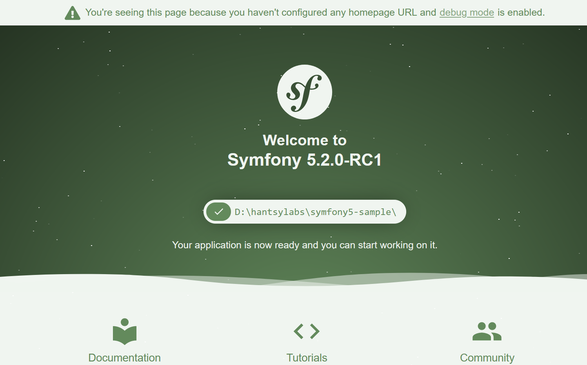
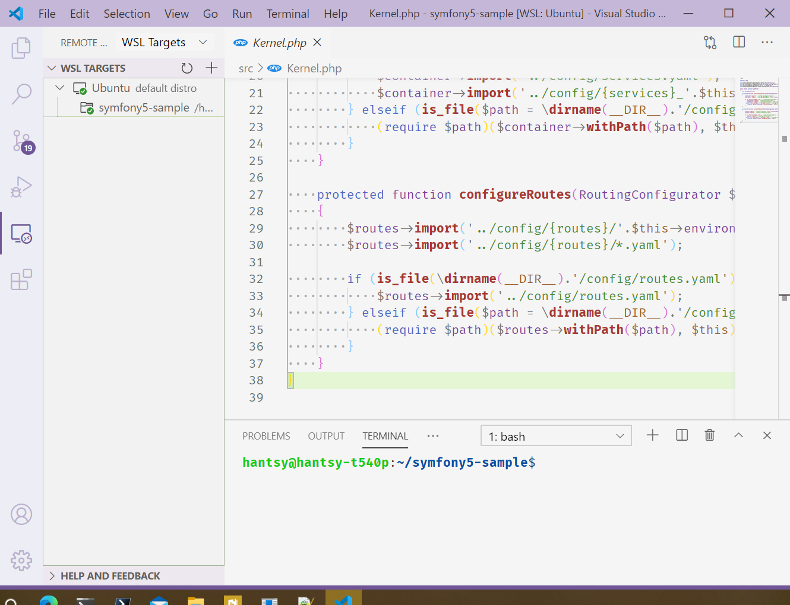
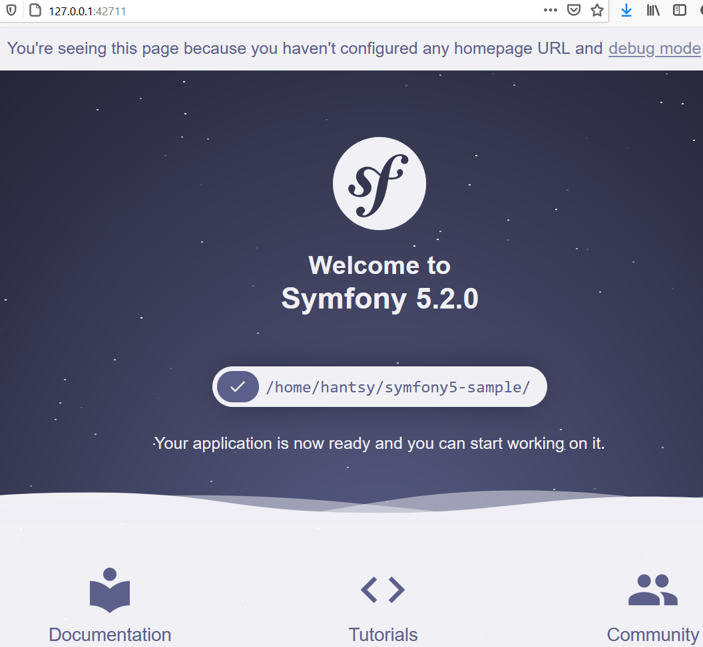

# Starting a Symfony 5 project under Windows 10

Most of the time, I work as a backend developer and focus on Java development using Java EE/Jakarta EE stack and Spring ecosystem. Personally I have some PHP experience several years ago, but I have not updated to the latest PHP ecosystem in these years. 

When we talk about PHP, we will connect to LAMP(aka Linux/Apache/MySQL/PHP) or LNMP(aka Linux/Ngnix/MySQL/PHP) in the mind.  GNU/Linux is the home land of PHP applications.  Even we developed PHP applications under other platforms, but finally we deployed them under a Linux server.

But not all people are Linux users, for most developers, Windows is absolutely a great choice. For my before experience, starting a PHP project under Windows is really not easy work, you have some choice.

* Install  the all-in-one [WAMP](https://sourceforge.net/projects/wampserver/) package to simplify Apache, MySQL, PHP configuration
* Sign  into a remote Linux server using SSH and write PHP codes on it directly
* Use a virtual machine under Windows to get LAMP/LNMP environment

Since PHP 5.4, the PHP CLI includes a built-in web server which significantly simplifies the development work, under Windows, we do not need to configure an extra http server, such as IIS server,  Apache server, Ngnix, etc. 


## Prerequisites 

* Install PHP and Composer.   For Windows users,  [Chocolatey](https://chocolatey.org) is easy to install software through `choco` command.
* [Install symfony CLI](https://symfony.com/download).
* Install Docker/Docker Compose. For Windows/MacOS, [install the latest Docker Desktop](https://docs.docker.com/docker-for-windows/install/).
* A Terminal tool, Windows built-in Powershell or Windows Terminal is great.
* Your favorited code editor, eg. VSCode, NetBeans 12.2 or IntelliJ PHPStorm, etc.


## Create a Symfony project

Open terminal, check  if the environment is satisfied to Symfony development.

```bash
> symfony check:requirements

 [OK]
 Your system is ready to run Symfony projects


Optional recommendations to improve your setup
~~~~~~~~~~~~~~~~~~~~~~~~~~~~~~~~~~~~~~~~~~~~~~

 * intl extension should be available
   > Install and enable the intl extension (used for validators).

 * a PHP accelerator should be installed
   > Install and/or enable a PHP accelerator (highly recommended).

 * PDO should have some drivers installed (currently available: none)
   > Install PDO drivers (mandatory for Doctrine).
...   
```

According to the information,  look up the following optional configuration in php.ini(*C:/tools/php8.0/php.ini*) and set them as the following.

```ini
realpath_cache_size = 5m
extension=intl
extension=pdo_pgsql
```

Create a new Symfony project.

```bash
# create a mini app skeleton
symfony new symfony5-sample
```
In the background, it will invoke Composer to prepare the project, eg.

* Download the project template and extract it into your local disk
* Install the requirements 

There are some other  options to initialize a new Symfony project.

```bash
# use the dev version
symfony new symfony5-sample --version=next

# create a full-featured traditional web application
symfony new symfony5-sample --full

# create a demo application using github.com/symfony/demo
symfony new symfony5-sample --demo
```
Enter the project folder, and start the application.

```bash
 symfony server:start 
 ...
 [OK] Web server listening
      The Web server is using PHP CGI 8.0.0
      https://127.0.0.1:8000
      
 ...     
```
As you see, the application is running at https://127.0.0.1:8000.

If you see a certification warning in the console, follow the tips to install the certification into your local system.

```bash
symfony server:ca:install
```

Open your browser, and navigate to https://127.0.0.1:8000.




## WSL 





```bash
symfony server:start
...

 [OK] Web server listening
      The Web server is using PHP CLI 8.0.0
      http://127.0.0.1:8000

[Web Server ] Dec  9 16:34:14 |INFO   | PHP    listening path="/usr/bin/php8.0" php="8.0.0" port=34511
[PHP        ] [Wed Dec  9 16:34:14 2020] PHP 8.0.0 Development Server (http://127.0.0.1:42711) started
```




 


## Reference

* [How to install/update PHP 8.0 (Debian/Ubuntu)](https://php.watch/articles/php-8.0-installation-update-guide-debian-ubuntu)
* [PHP Composer pakagist mirror ](https://www.phpcomposer.com/)